# Rapport de Travaux Pratiques : Application Web Spring Boot

**Filière :** GLSID - Génie du Logiciel et des Systèmes Informatiques Distribués  
**Encadrant :** Mohamed YOUSSFI  
**Étudiant(e) :** Youness HATTABI

---

## Table des Matières

1. [Introduction](#1-introduction)
2. [Création du projet Spring Boot](#2-création-du-projet-spring-boot)
3. [Couche Entité — `Product`](#3-couche-entité--product)
4. [Couche DAO — `ProductRepository`](#4-couche-dao--productrepository)
5. [Test de la couche DAO](#5-test-de-la-couche-dao)
6. [Désactivation de la sécurité par défaut](#6-désactivation-de-la-sécurité-par-défaut)
7. [Couche MVC — Contrôleur et Vues Thymeleaf](#7-couche-mvc--contrôleur-et-vues-thymeleaf)
   - 7.1 [Page template — Layout Bootstrap](#71-page-template--layout-bootstrap)
   - 7.2 [Affichage de la liste des produits](#72-affichage-de-la-liste-des-produits)
   - 7.3 [Suppression d'un produit](#73-suppression-dun-produit)
   - 7.4 [Saisie et ajout d'un produit avec validation](#74-saisie-et-ajout-dun-produit-avec-validation)
8. [Sécurisation avec Spring Security](#8-sécurisation-avec-spring-security)
9. [Fonctionnalités supplémentaires](#9-fonctionnalités-supplémentaires)
   - 9.1 [Recherche des produits](#91-recherche-des-produits)
   - 9.2 [Édition et mise à jour d'un produit](#92-édition-et-mise-à-jour-dun-produit)
   - 9.3 [Pagination](#93-pagination)
   - 9.4 [Tri par colonnes](#94-tri-par-colonnes)
   - 9.5 [Pages d'erreur personnalisées](#95-pages-derreur-personnalisées)
10. [Tests et Résultats](#10-tests-et-résultats)
11. [Conclusion](#11-conclusion)

---

## 1. Introduction

Les frameworks modernes de développement web orienté entreprise ont profondément transformé la manière dont les applications sont conçues et déployées. Spring Boot, en particulier, s'est imposé comme une référence incontournable dans l'écosystème Java, en simplifiant considérablement la configuration et le démarrage des projets grâce au principe de _convention over configuration_.

Ce rapport présente les travaux réalisés dans le cadre d'un projet Spring Boot complet, allant de la mise en place des dépendances jusqu'au déploiement d'une application web fonctionnelle de gestion de produits. L'application s'articule autour des couches classiques d'une architecture MVC : persistance via Spring Data JPA, présentation via Thymeleaf et Bootstrap, et sécurité via Spring Security. Des fonctionnalités avancées ont également été intégrées — pagination, tri dynamique des colonnes, filtrage par prix et gestion des pages d'erreur — afin de produire une application robuste et proche d'un cas d'usage réel.

---

## 2. Création du projet Spring Boot

Le projet est initialisé via l’extension vs code **Language Support for Java(TM) by Red Hat** avec les paramètres suivants :

| Paramètre   | Valeur |
| ----------- | ------ |
| Project     | Maven  |
| Language    | Java   |
| Spring Boot | 3.5.11 |
| Packaging   | JAR    |
| Java        | 17     |

### Dépendances sélectionnées

| Dépendance               | Rôle                                                                    |
| ------------------------ | ----------------------------------------------------------------------- |
| Spring Web               | Contrôleurs MVC, API REST                                               |
| Spring Data JPA          | Abstraction de la couche de persistance                                 |
| H2 Database              | Base de données embarquée pour les tests                                |
| MySQL Driver             | Base de données relationnelle en production                             |
| Thymeleaf                | Moteur de templates HTML côté serveur                                   |
| Thymeleaf Layout Dialect | Gestion des layouts réutilisables                                       |
| Lombok                   | Génération automatique de boilerplate (getters, setters, constructeurs) |
| Spring Security          | Authentification et autorisation                                        |
| Spring Validation        | Validation des formulaires (Bean Validation / Jakarta)                  |

### Structure du projet généré

```
Web App
   ├─ pom.xml
   ├─ src
   │  ├─ main
   │  │  ├─ java
   │  │  │  └─ hattabi
   │  │  │     └─ youness
   │  │  │        └─ web_app
   │  │  │           ├─ entities
   │  │  │           │  └─ Product.java
   │  │  │           ├─ repositories
   │  │  │           │  └─ ProductRepository.java
   │  │  │           ├─ security
   │  │  │           │  └─ SecurityConfig.java
   │  │  │           ├─ web
   │  │  │           │  ├─ LoginController.java
   │  │  │           │  └─ ProductController.java
   │  │  │           └─ WebAppApplication.java
   │  │  └─ resources
   │  │     ├─ application.properties
   │  │     ├─ static
   │  │     └─ templates
   │  │        ├─ addProduct.html
   │  │        ├─ error
   │  │        │  ├─ 403.html
   │  │        │  ├─ 404.html
   │  │        │  └─ 500.html
   │  │        ├─ layouts
   │  │        │  └─ main.html
   │  │        ├─ login.html
   │  │        └─ products.html

```

### Configuration `application.properties`

```properties
spring.application.name=web_app
spring.datasource.url=${DB_URL}
spring.datasource.username=${DB_USER}
spring.datasource.password=${DB_PASSWORD}
spring.jpa.hibernate.ddl-auto=update
spring.thymeleaf.cache=false
```

---

## 3. Couche Entité — `Product`

L'entité `Product` représente un produit du catalogue. Elle est annotée avec les annotations JPA standard pour définir le mapping objet-relationnel, et avec les annotations Lombok pour éliminer le code répétitif.

```java
@Entity
@Data
@NoArgsConstructor
@AllArgsConstructor
@Builder
public class Product {
    @Id
    @GeneratedValue(strategy = GenerationType.IDENTITY)
    private long id;

    @NotEmpty(message = "Product name cannot be empty")
    private String name;

    @Positive(message = "Price must be positive")
    private double price;

    @Min(value = 0, message = "Quantity cannot be negative")
    private int quantity;

    @CreationTimestamp
    private LocalDateTime createdAt;

    @UpdateTimestamp
    private LocalDateTime updatedAt;
}
```

---

## 4. Couche DAO — `ProductRepository`

L'interface `ProductRepository` étend `JpaRepository`, ce qui fournit automatiquement les opérations CRUD de base ainsi qu'un ensemble de méthodes utilitaires. Des méthodes personnalisées sont ajoutées pour les besoins de recherche, de filtrage et de pagination.

```java
public interface ProductRepository extends JpaRepository<Product, Long> {
    Page<Product> findByNameContainingIgnoreCaseAndPriceBetween(String name, double min, double max, Pageable pageable);
}
```

---

## 5. Test de la couche DAO

Des données de test sont insérées au démarrage de l'application via un `CommandLineRunner`, et des tests unitaires valident les opérations de la couche DAO.

### Données de test au démarrage

```java
@SpringBootApplication
public class WebAppApplication {

	public static void main(String[] args) {
		SpringApplication.run(WebAppApplication.class, args);
	}

	@Bean
	CommandLineRunner start(ProductRepository productRepository) {
		return args -> {
			productRepository.save(Product.builder()
					.name("Computer")
					.price(8000)
					.quantity(5)
					.build());

			productRepository.save(Product.builder()
					.name("Printer")
					.price(1200)
					.quantity(10)
					.build());

			productRepository.findAll().forEach(p -> {
				System.out.println(p.getName());
			});
		};
	}

}
```

---

## 6. Désactivation de la sécurité par défaut

Au cours de la phase de développement initiale, la protection automatique de Spring Security est désactivée afin de pouvoir accéder librement à l'application et valider les fonctionnalités MVC.

```java
@Configuration
public class SecurityConfig {
    @Bean
    SecurityFilterChain securityFilterChain(HttpSecurity http) throws Exception {
        http
                .csrf(csrf -> csrf.disable())
                .authorizeHttpRequests(auth -> auth
                        .anyRequest().permitAll());

        return http.build();
    }
}
```

---

## 7. Couche MVC — Contrôleur et Vues Thymeleaf

### 7.1 Page template — Layout Bootstrap

Le layout partagé utilise le **Thymeleaf Layout Dialect** pour définir une structure de page réutilisable, intégrant Bootstrap 5 pour le style et la mise en page responsive.

**`src/main/resources/templates/layouts/main.html`**

```html
<!doctype html>
<html
  xmlns:th="http://www.thymeleaf.org"
  xmlns:layout="http://www.ultraq.net.nz/thymeleaf/layout"
  xmlns:sec="http://www.thymeleaf.org/extras/spring-security">
  <head>
    <meta charset="UTF-8" />
    <title layout:title-pattern="$CONTENT_TITLE - Demo Web App">
      Demo Web App
    </title>

    <link
      rel="stylesheet"
      href="https://cdn.jsdelivr.net/npm/bootstrap@5.3.2/dist/css/bootstrap.min.css" />
  </head>

  <body>
    <nav class="navbar navbar-expand-lg navbar-dark bg-dark">
      <div class="container-fluid">
        <a class="navbar-brand" href="/products">Product Manager</a>
        <div sec:authorize="isAuthenticated()" class="d-flex">
          <form th:action="@{/logout}" method="post">
            <button type="submit" class="btn btn-outline-light btn-sm">
              Logout
            </button>
          </form>
        </div>
      </div>
    </nav>

    <div class="container mt-4">
      <div layout:fragment="content"></div>
    </div>
  </body>
</html>
```

---

### 7.2 Affichage de la liste des produits

#### Contrôleur

```java
@GetMapping("/products")
    public String products(@RequestParam(required = false, defaultValue = "") String keyword,
            @RequestParam(defaultValue = "0") int page,
            @RequestParam(defaultValue = "5") int size,
            @RequestParam(defaultValue = "id") String sortField,
            @RequestParam(defaultValue = "asc") String sortDir,
            @RequestParam(required = false) Double minPrice, @RequestParam(required = false) Double maxPrice,
            Model model) {

        if (minPrice == null)
            minPrice = 0.0;
        if (maxPrice == null)
            maxPrice = Double.MAX_VALUE;

        Pageable pageable = PageRequest.of(page, size,
                sortDir.equals("asc") ? Sort.by(sortField).ascending() : Sort.by(sortField).descending());

        Page<Product> productPage = productRepository
                .findByNameContainingIgnoreCaseAndPriceBetween(keyword, minPrice, maxPrice, pageable);

        model.addAttribute("productPage", productPage);
        model.addAttribute("currentPage", page);
        model.addAttribute("totalPages", productPage.getTotalPages());
        model.addAttribute("sortField", sortField);
        model.addAttribute("sortDir", sortDir);
        model.addAttribute("reverseSortDir", sortDir.equals("asc") ? "desc" : "asc");

        model.addAttribute("keyword", keyword);
        model.addAttribute("minPrice", minPrice == 0.0 ? "" : minPrice);
        model.addAttribute("maxPrice", maxPrice == Double.MAX_VALUE ? "" : maxPrice);
        return "products";
    }
```

#### Vue `products.html`

```html
<!doctype html>
<html
  xmlns:th="http://www.thymeleaf.org"
  xmlns:layout="http://www.ultraq.net.nz/thymeleaf/layout"
  layout:decorate="~{layouts/main}">
  <head>
    <title>Products</title>
  </head>

  <body>
    <div layout:fragment="content">
      <h2 class="mb-3">Product List</h2>

      <form
        th:action="@{/products}"
        method="get"
        class="mb-3 d-flex flex-wrap align-items-center">
        <input
          type="text"
          name="keyword"
          th:value="${keyword}"
          class="form-control me-2 mb-2"
          placeholder="Search by name" />

        <input
          type="number"
          name="minPrice"
          th:value="${minPrice}"
          step="0.01"
          class="form-control me-2 mb-2"
          placeholder="Min Price" />

        <input
          type="number"
          name="maxPrice"
          th:value="${maxPrice}"
          step="0.01"
          class="form-control me-2 mb-2"
          placeholder="Max Price" />

        <button type="submit" class="btn btn-outline-primary me-2 mb-2">
          Filter
        </button>
        <a th:href="@{/products}" class="btn btn-outline-secondary mb-2"
          >Reset</a
        >
      </form>
      <a href="/addProduct" class="btn btn-success mb-3">Add Product</a>

      <table class="table table-bordered table-striped">
        <thead class="table-dark">
          <tr>
            <th>
              <a
                class="text-decoration-none text-white"
                th:href="@{|/products?page=0&sortField=id&sortDir=${reverseSortDir}&minPrice=${minPrice}&maxPrice=${maxPrice}|}"
                >ID</a
              >
            </th>
            <th>
              <a
                class="text-decoration-none text-white"
                th:href="@{|/products?page=0&sortField=name&sortDir=${reverseSortDir}&minPrice=${minPrice}&maxPrice=${maxPrice}|}"
                >Name</a
              >
            </th>
            <th>
              <a
                class="text-decoration-none text-white"
                th:href="@{|/products?page=0&sortField=price&sortDir=${reverseSortDir}&minPrice=${minPrice}&maxPrice=${maxPrice}|}"
                >Price</a
              >
            </th>
            <th>
              <a
                class="text-decoration-none text-white"
                th:href="@{|/products?page=0&sortField=quantity&sortDir=${reverseSortDir}&minPrice=${minPrice}&maxPrice=${maxPrice}|}"
                >Quantity</a
              >
            </th>
            <th>Created At</th>
            <th>Updated At</th>
            <th sec:authorize="hasRole('ADMIN')">Actions</th>
          </tr>
        </thead>
        <tbody>
          <tr th:each="p : ${productPage.content}">
            <td th:text="${p.id}"></td>
            <td th:text="${p.name}"></td>
            <td th:text="${p.price}"></td>
            <td th:text="${p.quantity}"></td>
            <td
              th:text="${#temporals.format(p.createdAt, 'yyyy-MM-dd HH:mm')}"></td>
            <td
              th:text="${p.updatedAt != null ? #temporals.format(p.updatedAt, 'yyyy-MM-dd HH:mm') : '-'}"></td>
            <td sec:authorize="hasRole('ADMIN')">
              <a
                th:href="@{/editProduct(id=${p.id})}"
                class="btn btn-warning btn-sm">
                Edit
              </a>
              <a
                th:href="@{/deleteProduct(id=${p.id})}"
                class="btn btn-danger btn-sm"
                onclick="return confirm('Are you sure?');">
                Delete
              </a>
            </td>
          </tr>
        </tbody>
      </table>
      <nav th:if="${totalPages > 1}">
        <ul class="pagination">
          <li
            class="page-item"
            th:classappend="${currentPage == 0}? 'disabled'">
            <a
              class="page-link"
              th:href="@{|/products?page=${currentPage - 1}&sortField=${sortField}&sortDir=${sortDir}&keyword=${keyword}&minPrice=${minPrice}&maxPrice=${maxPrice}|}">
              Previous
            </a>
          </li>

          <li
            class="page-item"
            th:each="i : ${#numbers.sequence(0, totalPages - 1)}"
            th:classappend="${i == currentPage}? 'active'">
            <a
              class="page-link"
              th:href="@{|/products?page=${i}&sortField=${sortField}&sortDir=${sortDir}&keyword=${keyword}&minPrice=${minPrice}&maxPrice=${maxPrice}|}"
              th:text="${i + 1}"
              >1</a
            >
          </li>

          <li
            class="page-item"
            th:classappend="${currentPage == totalPages -1}? 'disabled'">
            <a
              class="page-link"
              th:href="@{|/products?page=${currentPage + 1}&sortField=${sortField}&sortDir=${sortDir}&keyword=${keyword}&minPrice=${minPrice}&maxPrice=${maxPrice}|}">
              Next
            </a>
          </li>
        </ul>
      </nav>
    </div>
  </body>
</html>
```

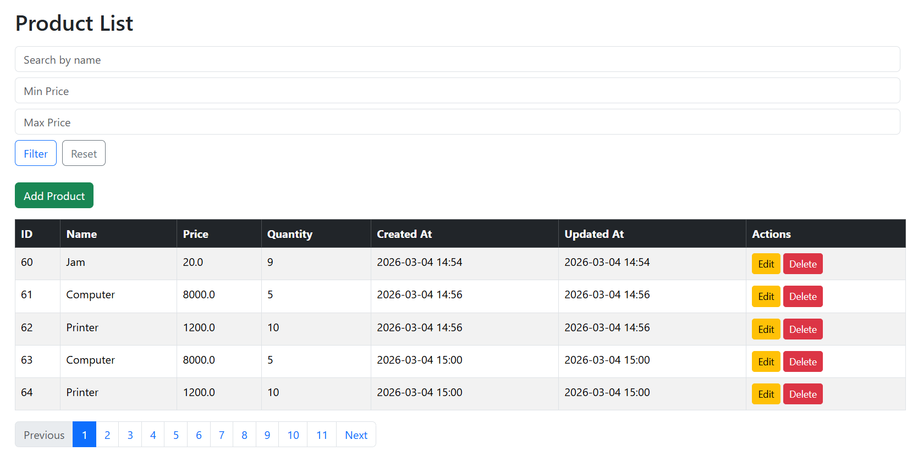

---

### 7.3 Suppression d'un produit

La suppression est déclenchée via un lien GET protégé par une boîte de confirmation JavaScript, puis traitée par le contrôleur.

```java
@GetMapping("/deleteProduct")
    public String deleteProduct(@RequestParam Long id) {
        productRepository.deleteById(id);
        return "redirect:/products";
    }
```

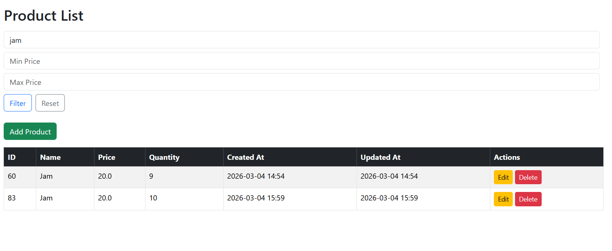

---

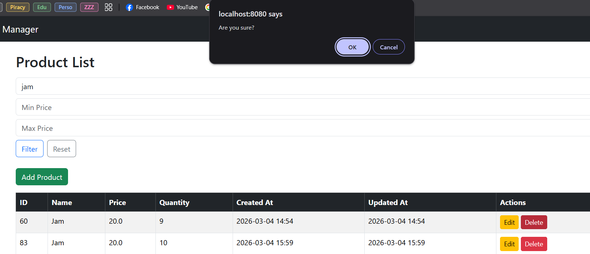

---

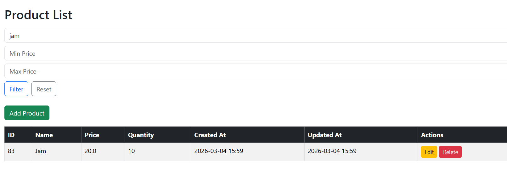

---

### 7.4 Saisie et ajout d'un produit avec validation

#### Contrôleur — Affichage et traitement du formulaire

```java
@GetMapping("/addProduct")
    public String addProduct(Model model) {
        model.addAttribute("product", new Product());
        return "addProduct";
    }

@PostMapping("/saveProduct")
    public String saveProduct(@Valid Product product, BindingResult bindingResult) {
        if (bindingResult.hasErrors()) {
            return "addProduct";
        }

        productRepository.save(product);
        return "redirect:/products";
    }
```

#### Vue `addProduct.html`

```html
<!doctype html>
<html
  xmlns:th="http://www.thymeleaf.org"
  xmlns:layout="http://www.ultraq.net.nz/thymeleaf/layout"
  layout:decorate="~{layouts/main}">
  <head>
    <title>Add Product</title>
  </head>

  <body>
    <div layout:fragment="content">
      <h2>Add New Product</h2>

      <form th:action="@{/saveProduct}" th:object="${product}" method="post">
        <input type="hidden" th:field="*{id}" />
        <input type="hidden" th:field="*{createdAt}" />
        <div class="mb-3">
          <label>Name</label>
          <input type="text" th:field="*{name}" class="form-control" />
          <div
            class="text-danger"
            th:if="${#fields.hasErrors('name')}"
            th:errors="*{name}"></div>
        </div>

        <div class="mb-3">
          <label>Price</label>
          <input
            type="number"
            step="0.01"
            th:field="*{price}"
            class="form-control" />
          <div
            class="text-danger"
            th:if="${#fields.hasErrors('price')}"
            th:errors="*{price}"></div>
        </div>

        <div class="mb-3">
          <label>Quantity</label>
          <input type="number" th:field="*{quantity}" class="form-control" />
          <div
            class="text-danger"
            th:if="${#fields.hasErrors('quantity')}"
            th:errors="*{quantity}"></div>
        </div>

        <button type="submit" class="btn btn-primary">Save</button>
        <a href="/products" class="btn btn-secondary">Cancel</a>
      </form>
    </div>
  </body>
</html>
```

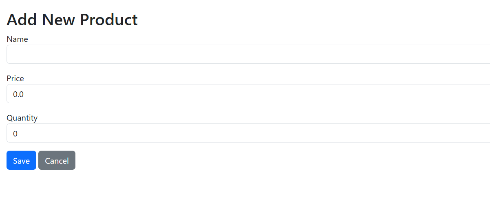

---

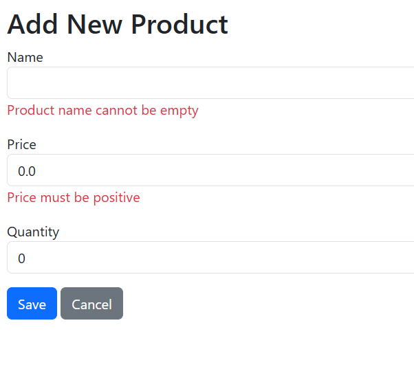

---

## 8. Sécurisation avec Spring Security

La configuration de sécurité définit deux rôles distincts : `USER` (lecture seule) et `ADMIN` (accès complet incluant création, modification et suppression). L'authentification est gérée en mémoire à des fins de démonstration.

```java
@Configuration
public class SecurityConfig {
        @Bean
        public InMemoryUserDetailsManager userDetailsService(PasswordEncoder passwordEncoder) {
                UserDetails user = User.builder()
                                .username("user")
                                .password(passwordEncoder.encode("Pa$$w0rd!123"))
                                .roles("USER")
                                .build();

                UserDetails admin = User.builder()
                                .username("admin")
                                .password(passwordEncoder.encode("Pa$$w0rd!123"))
                                .roles("ADMIN")
                                .build();

                return new InMemoryUserDetailsManager(user, admin);
        }

        @Bean
        public SecurityFilterChain securityFilterChain(HttpSecurity http) throws Exception {
                http
                                .authorizeHttpRequests(auth -> auth
                                                .requestMatchers("/products").hasAnyRole("USER", "ADMIN")
                                                .requestMatchers("/addProduct", "/saveProduct", "/deleteProduct",
                                                                "/editProduct")
                                                .hasRole("ADMIN")
                                                .anyRequest().authenticated())
                                .formLogin(form -> form
                                                .loginPage("/login")
                                                .defaultSuccessUrl("/products", true)
                                                .permitAll())
                                .logout(logout -> logout
                                                .logoutSuccessUrl("/login?logout")
                                                .permitAll());

                return http.build();
        }

        @Bean
        public PasswordEncoder passwordEncoder() {
                return new BCryptPasswordEncoder();
        }
}
```

### Page de connexion personnalisée (`login.html`)

```html
<!doctype html>
<html
  xmlns:th="http://www.thymeleaf.org"
  layout:decorate="~{layouts/main}"
  xmlns:layout="http://www.ultraq.net.nz/thymeleaf/layout">
  <head>
    <title>Login</title>
  </head>

  <body>
    <div layout:fragment="content">
      <h2>Login</h2>

      <form th:action="@{/login}" method="post">
        <div class="mb-3">
          <label>Username</label>
          <input type="text" name="username" class="form-control" />
        </div>

        <div class="mb-3">
          <label>Password</label>
          <input type="password" name="password" class="form-control" />
        </div>

        <button type="submit" class="btn btn-primary">Login</button>
      </form>

      <div th:if="${param.error}" class="text-danger mt-2">
        Invalid username or password.
      </div>

      <div th:if="${param.logout}" class="text-success mt-2">
        You have been logged out.
      </div>
    </div>
  </body>
</html>
```

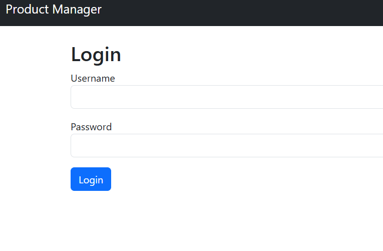

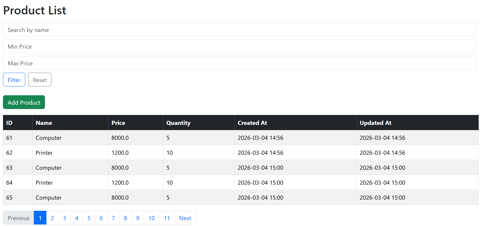

---

## 9. Fonctionnalités supplémentaires

### 9.1 Recherche des produits

La recherche est intégrée directement dans la vue `list.html` via un formulaire GET. Elle filtre les produits par nom (insensible à la casse) en transmettant le paramètre `keyword` au contrôleur, lequel délègue la requête à la méthode `findByNameContainingIgnoreCaseAndPriceBetween` du repository.


---

### 9.2 Édition et mise à jour d'un produit

#### Contrôleur

```java
@GetMapping("/editProduct")
    public String editProduct(@RequestParam Long id, Model model) {
        Product product = productRepository.findById(id)
                .orElseThrow(() -> new RuntimeException("Product not found"));

        model.addAttribute("product", product);
        return "addProduct";
    }
```

Le même formulaire `form.html` est réutilisé pour l'édition grâce au champ caché `id`. Lorsque ce champ est non nul, le contrôleur `saveProduct` effectue une mise à jour via `productRepository.save()` (comportement _upsert_ de Spring Data).

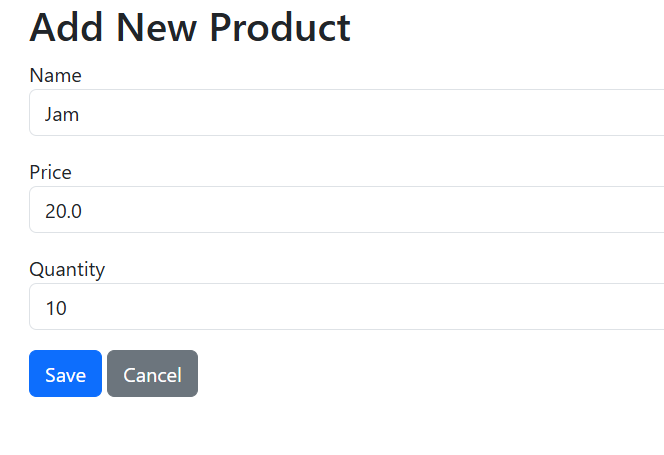

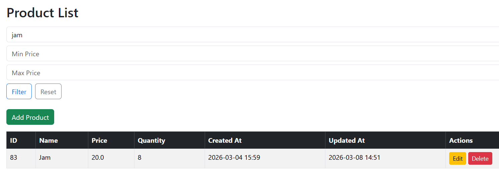

---

### 9.3 Pagination

La pagination est implémentée via l'interface `Pageable` de Spring Data et le composant `Page<Product>`. Le contrôleur transmet au modèle le numéro de page courant, le nombre total de pages et la taille de page. La vue affiche les contrôles de navigation et permet de choisir la taille de page (5, 10, 20 éléments).

**Paramètres supportés :**

- `page` : numéro de la page courante (base 0)
- `size` : nombre d'éléments par page
- Ces paramètres sont conservés lors des opérations de recherche et de tri

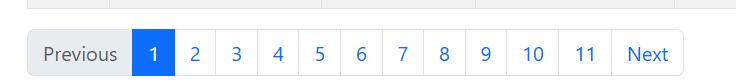

---

### 9.4 Tri par colonnes

Chaque en-tête de colonne triable (`#`, `Nom`, `Prix`) est un lien qui transmet les paramètres `sortBy` et `sortDir` au contrôleur. Le sens du tri est inversé automatiquement si la colonne est déjà active, offrant ainsi un tri alternatif ascendant/descendant. Une icône Bootstrap `bi-arrow-down-up` indique visuellement les colonnes triables.

```java
Pageable pageable = PageRequest.of(page, size,
                sortDir.equals("asc") ? Sort.by(sortField).ascending() : Sort.by(sortField).descending());
```

---

### 9.5 Pages d'erreur personnalisées

Des pages d'erreur dédiées ont été créées pour améliorer l'expérience utilisateur en cas d'accès non autorisé ou de ressource introuvable.

**`error/403.html`**

```html
<!doctype html>
<html xmlns:th="http://www.thymeleaf.org">
  <head>
    <title>403 - Forbidden</title>
    <link
      rel="stylesheet"
      href="https://cdn.jsdelivr.net/npm/bootstrap@5.3.2/dist/css/bootstrap.min.css" />
  </head>
  <body class="bg-light">
    <div class="container text-center mt-5">
      <h1 class="display-1 text-danger">403</h1>
      <h3>Forbidden Access</h3>
      <p>You are not authorized to access this page.</p>
      <a th:href="@{/products}" class="btn btn-primary mt-3"
        >Back to Products</a
      >
    </div>
  </body>
</html>
```

**`error/404.html`**

```html
<!doctype html>
<html xmlns:th="http://www.thymeleaf.org">
  <head>
    <title>404 - Not Found</title>
    <link
      rel="stylesheet"
      href="https://cdn.jsdelivr.net/npm/bootstrap@5.3.2/dist/css/bootstrap.min.css" />
  </head>
  <body class="bg-light">
    <div class="container text-center mt-5">
      <h1 class="display-1 text-danger">404</h1>
      <h3>Page Not Found</h3>
      <p>The page you are looking for does not exist.</p>
      <a th:href="@{/products}" class="btn btn-primary mt-3"
        >Back to Products</a
      >
    </div>
  </body>
</html>
```

**`error/500.html`**

```html
<!doctype html>
<html xmlns:th="http://www.thymeleaf.org">
  <head>
    <title>500 - Internal Server Error</title>
    <link
      rel="stylesheet"
      href="https://cdn.jsdelivr.net/npm/bootstrap@5.3.2/dist/css/bootstrap.min.css" />
  </head>
  <body class="bg-light">
    <div class="container text-center mt-5">
      <h1 class="display-1 text-danger">500</h1>
      <h3>Internal Server Error</h3>
      <p>An error occurred while processing your request.</p>
      <a th:href="@{/products}" class="btn btn-primary mt-3"
        >Back to Products</a
      >
    </div>
  </body>
</html>
```

---
